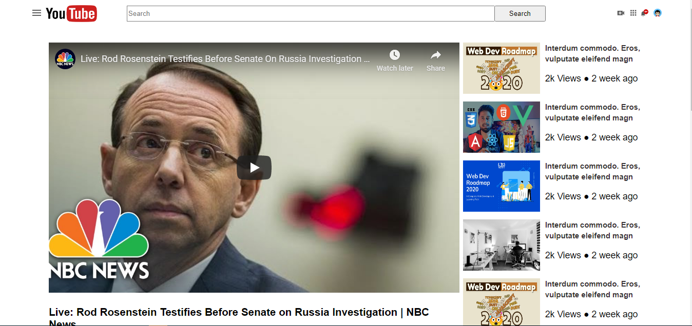

# Youtube_Home_Page (Embedding Images and Video)

> Microverse Collaborative Project (Stanley and Umair)

Additional description about the project and its features.

## Built With

- HTML,
- CSS,

## Live Demo

[Live Demo Link](https://happiguru.github.io/Youtube_Home_Page/)

## Getting Started

**This is an example of how you may give instructions on setting up your project locally.**
**Modify this file to match your project, remove sections that don't apply. For example: delete the testing section if the currect project doesn't require testing.**

To get a local copy up and running follow these simple example steps.

### Prerequisites

## Authors

👤 **Stanley Enow Lekunze**

- Github: [@githubhandle](https://github.com/happiguru)
- Twitter: [@twitterhandle](https://twitter.com/Lekunze_Nley)
- Linkedin: [linkedin](https://www.linkedin.com/in/lekunze-nley/)

👤 **Umair Arshad**

- Github: [@githubhandle](https://github.com/umairarshadbutt)
- Twitter: [@twitterhandle](https://twitter.com/its_UmairArshad)
- Linkedin: [linkedin](https://www.linkedin.com/in/umair-arshad-butt/)

## Show your support

Give a ⭐️ if you like this project!

## Acknowledgments

- Hat tip to anyone whose code was used
- Inspiration
- etc

## 📝 License

This project is [MIT](lic.url) licensed.
